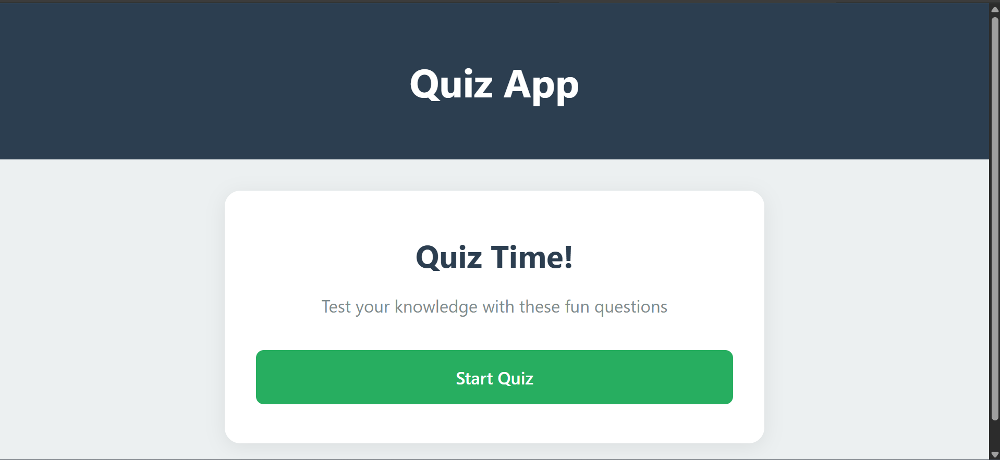
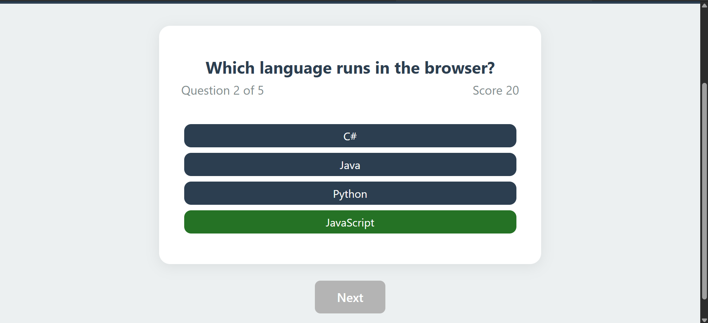
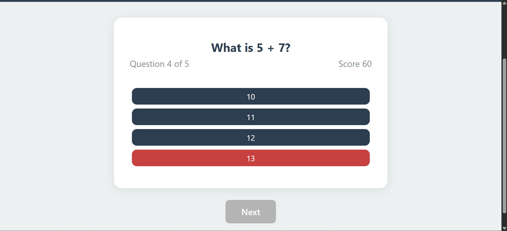
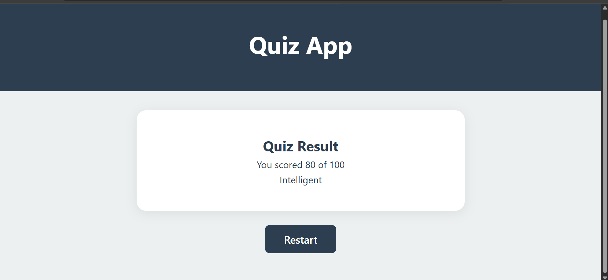

# ⁉️ Quiz Game (Vanilla JavaScript)
A responsive quiz web application built using vanilla JavaScript and TypeScript that tests user knowledge through multiple-choice questions with real-time scoring and feedback.

## ✅ Features
- ❓ Displays multiple-choice questions from a predefined dataset.
- 🏁 Checks the selected answer by the user.
- 🎨 Highlights answers in green (correct) or red (wrong) to improve user experience.
- 🔒 Prevents multiple selections for the same question.
- 🔀 Tracks score throughout the quiz.
- 💯 Shows the final score with a status message.
- 📱Responsive design techniques, to adapt to different screen sizes.

## ⚙️ Technologies:
- HTML
- CSS
- Vanilla JavaScript
- TypeScript

## 🚀 How to Run
1. Clone the repository:
   ```bash
   git clone https://github.com/malakmuayad11/QuizGame.git
2. Open index.html in your browser.

## 📸 Screenshots






## 👩‍💻 Author
**Malak Muayad**  
📧 [malakmuayad15@gmail.com](mailto:malakmuayad15@gmail.com)  
🔗 [malakmuayad11](https://github.com/malakmuayad11)
